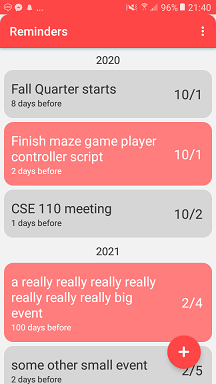
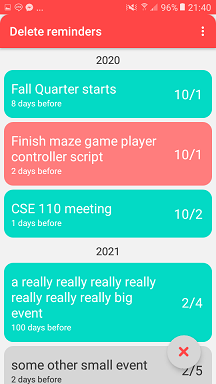
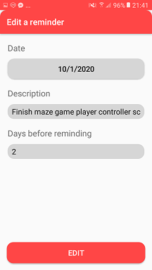
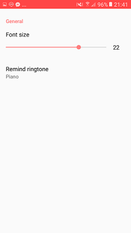

# Reminders! 
### A lightweight Android app that notifies you an event everyday for howevery many days you'd like prior.

## Features
Reminders provides basic features such as:
* Adding - simply tap on the floating button at bottom right
* Deleting - selection by first holding down on an event until it turns blue, (then tap on more events to choose them if you'd like), and tap on the cross button on bottom right to delete
* Editing - simply tap on the event you want to edit

... as well as other features including:
* Reminding the user of an event starting from some number of days before the event (when booting up or when a day rolls over to the next at midnight)
* Preventing duplicate events
* Setting the font size (menu at top right, 3 dots)
* Setting the notification ringtone (top right, 3 dots)
* Notifying from the status bar (top of phone)
* Having a cute calendar face when there are no reminders!

## What do you mean by x days before?
On each event, you'll see "x days before," meaning that notifications will pop up starting from x days before the event. For example, for the event "some other small event," 2 days before 2/5 is 2/3, so Reminders will remind you on 2/3, 2/4, and then on 2/5.

That's it! Easy to use, lightweight, and gets yourself together.